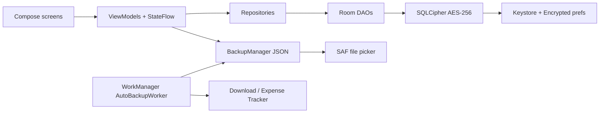

# Expense Tracker

**Private, offline expense tracking for Android** — monthly budgets, custom categories, search, and spending insights. Data never leaves the device. Amounts are in Indian Rupees (₹).

Built with **Kotlin**, **Jetpack Compose**, **Material 3**, **Hilt**, **Room**, **SQLCipher**, and **WorkManager**.

[Features](#features) · [Architecture](#architecture) · [Screens](#screens) · [Data](#data-model) · [Build](#build--run) · [Security](#security) · [Docs](#further-reading)

---

## Why this app

| | |
| --- | --- |
| **Offline-first** | No account, no network, no analytics SDK. Room is the source of truth. |
| **Encrypted at rest** | SQLCipher AES-256; passphrase in Android Keystore + EncryptedSharedPreferences. |
| **INR-native** | Indian grouping (lakh/crore) and the ₹ symbol throughout. |
| **Yours to shape** | Rename, reorder, and add categories; exclude some from a given month’s budget. |

Uninstalling the app **destroys the encryption key**. Export a backup from Settings (or keep automatic backups in `Download/Expense Tracker`) before you wipe the install.

---

## Features

### Track
- Browse expenses **by month** (previous / next, jump to today).
- Add, edit, delete (swipe-to-delete with confirmation).
- Title, amount, category, date, optional description.

### Search
Open **Search** from Home (magnifying glass). Looks across **all months**, not just the current one.

- Match **title or description** (debounced as you type).
- Filter by **categories**, **amount range**, and **date range**.
- Sort by date or amount (newest / oldest / highest / lowest).
- Result count and **sum of matching amounts**; lists cap at **500** matches and say so if truncated.

### Budget
- Set an **expected monthly amount** (Settings → Monthly budget) for a chosen month and year.
- Home shows used vs remaining or overspent, plus progress.
- **Exclude categories per month**; they still appear in lists and breakdowns.

### Categories
- **17 defaults** (emoji + English names), fully editable.
- Home: **top 5** for the month, then “view all”.
- Drill into one category for that month.
- Cannot delete a category that still has expenses; renames cascade to expenses and budget exclusions.

### Insights
Open **Settings → Insights → Spending insights**.

| Period | Meaning |
| --- | --- |
| Last 6 months | Rolling six calendar months including the current one |
| This year | Calendar year-to-date (January through the current month) |
| Custom | Material 3 date-range picker (exact start/end days) |

Metrics: **total**, **monthly average** (divides by every month in the range, including ₹0 months), **highest month**, **lowest month**. The **current calendar month is omitted from lowest** so a partial month is not treated as cheapest.

### Settings
- Dark / light theme
- Optional **biometric or device PIN** lock on launch
- JSON **export / import** via the Storage Access Framework (no storage permission on API 29+)
- Import **merge** or **replace**; backups v1–v3 (expenses → +budgets/exclusions → +categories)
- **Automatic backup** (opt-in): WorkManager checks about every **12 hours**, writes JSON only when data has changed, keeps the **5 newest** files in `Download/Expense Tracker` (survives uninstall). API 26–28 needs the legacy storage permission.

---

## Architecture

MVVM with a single-activity Compose UI. Repositories expose **Kotlin Flow**; ViewModels combine them into `StateFlow` UI state. Hilt wires database, backup, WorkManager, and preferences.


```mermaid
flowchart LR
  UI["Compose screens"] --> VM["ViewModels + StateFlow"]
  VM --> Repo["Repositories"]
  Repo --> Room["Room DAOs"]
  Room --> SQL["SQLCipher AES-256"]
  SQL --> KS["Keystore + Encrypted prefs"]
  VM --> Backup["BackupManager JSON"]
  Backup --> SAF["SAF file picker"]
  WM["WorkManager AutoBackupWorker"] --> Backup
  WM --> Files["Download / Expense Tracker"]
```

```
app/src/main/java/com/snagar/expensetracker/
├── backup/        AutoBackupWorker, AutoBackupStore, BackupFileStore
├── data/          entities, DAOs, repositories, preferences, search filter
├── di/            Hilt modules
├── nav/           Navigation 3 routes
├── ui/screen/     Home, search, expenses, reports, settings, budget, categories, lock
├── ui/components/ shared Compose widgets
├── ui/theme/      Material 3 theme
├── viewmodel/
├── util/          dates, insights, backup JSON, biometrics, keys
├── ExpenseTrackerApplication.kt
└── MainActivity.kt
```

WorkManager is initialized **on demand** (the default startup provider is removed) so its database is not opened on every cold start.

---

## Screens

| Screen | What you do |
| --- | --- |
| Home | Month nav, budget/total, top categories, recent expenses, search, settings, add FAB |
| Search | Full-history search with filters, sort, result total, swipe-to-delete |
| Add / Edit | Form with category and date |
| Detail | Full record, edit, delete |
| All categories | Share of spend for the month |
| Category expenses | Transactions in one category |
| Spending insights | Period chips, optional calendar range, summary + categories |
| Settings | Theme, lock, budget, insights, manage categories, backup |
| Monthly budget | Amount, clear, per-month exclusions |
| Manage categories | Add, edit, reorder, emoji, delete |
| Biometric lock | Shown when lock is enabled |

---

## Data model

Local Room database (version 7), encrypted. Indexes on `expenses.date`, `expenses.category`, and `budget_excluded_categories.category`. WAL journal mode.

| Table | Role |
| --- | --- |
| `expenses` | `id`, `title`, `amount`, `category`, `description`, `date`, `createdAt` |
| `monthly_budgets` | Expected amount per month + year |
| `budget_excluded_categories` | `(month, year, category)` omitted from that month’s used / remaining |
| `categories` | User name (primary key), emoji, sort order |

**Default categories:** Bills & Utilities 💡 · Transportation 🚗 · Food & Dining 🍔 · Personal Care 💆 · EMI 💳 · Baby 👶 · Groceries 🛒 · Investments 📈 · Travel ✈️ · Shopping 🛍️ · Entertainment 🎬 · Healthcare 🏥 · Education 📚 · Rent 🏠 · Insurance 🛡️ · Gifts 🎁 · Other 💰

Backup JSON is versioned:

1. Expenses only
2. + monthly budgets and exclusions
3. + user categories

Older files still import; missing lists are treated as empty. Manual export and auto-backup share the same snapshot (one database transaction). Auto-backup filenames use `expense_autobackup_…` so retention never deletes a hand-exported file in the same folder.

---

## Stack

| | Version |
| --- | --- |
| Kotlin | 2.2.0 |
| AGP | 8.13.1 |
| Compose BOM | 2026.03.00 |
| Room | 2.8.4 |
| SQLCipher | 4.6.1 |
| Navigation 3 | 1.1.5 |
| Hilt | 2.57.1 |
| WorkManager | 2.11.2 |
| Gson | 2.11.0 |
| minSdk / targetSdk / compileSdk | 26 / 36 / 36 |
| JDK | 11 |

Also: KSP, ktlint 14, R8 (release, with resource shrinking), native libs packaged without legacy zip alignment (`useLegacyPackaging = false`) for **16 KB page sizes** on Android 15+. Debug APKs are named `ExpenseTracker-{versionName}-{buildType}.apk`.

Unit tests: JUnit 4, MockK, Turbine, Truth, coroutines-test (repositories, backup, reports, dates).

---

## Build & run

**Need:** Android Studio (current stable), JDK 11+, Android SDK 36.

```bash
./gradlew :app:assembleDebug
./gradlew :app:testDebugUnitTest
./gradlew :app:ktlintCheck
```

Open the project in Android Studio, sync Gradle, and run on a device or emulator (API 26+).

---

## Security

1. On first launch, a random 256-bit passphrase is generated.
2. It is stored in EncryptedSharedPreferences, wrapped by the Android Keystore (hardware-backed when the device allows).
3. SQLCipher encrypts the database file; Room usage is unchanged.

There are **no hardcoded keys**. App updates keep the key; **uninstall does not**.

Optional **biometric lock** is a UI gate; it does not replace database encryption.

Automatic backups are **plain JSON** on shared storage so they remain usable after uninstall. Treat that folder as sensitive.

Full write-up: [ENCRYPTION.md](ENCRYPTION.md).

---

## Further reading

- [ENCRYPTION.md](ENCRYPTION.md) — key lifecycle, SQLCipher, uninstall implications
- [16KB_PAGE_SIZE.md](16KB_PAGE_SIZE.md) — Play 16 KB page-size requirements and native packaging

---

## Roadmap

Not in the app yet:

- Recurring expenses
- Tags and charts
- CSV / PDF export
- Multiple currencies
- Receipt photos
- Encrypted backups (auto-backups today are unencrypted JSON)
- Cloud sync

---

Personal project. Kotlin + Jetpack Compose.
